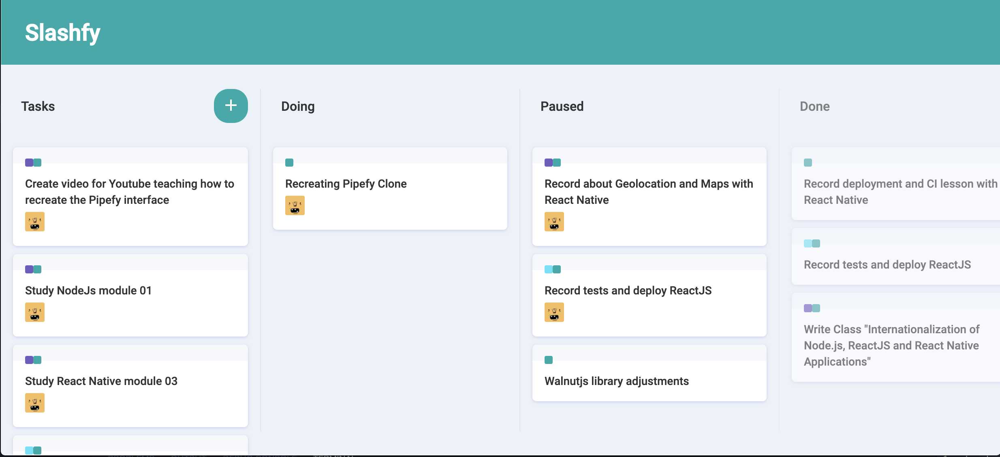

# Slashfy

- Simple UI Clone of Pipefy to work with **drag-and-drop** in ReactJS.

  

## What I've learned

- I have an interaction with drag-and-drop in react
- I learn new css tricks
- Little use of react-hooks with contextAPI

## How to test this implementation

In the project directory, you can run:

- `yarn`: Intalling dependencies
- `yarn start` : Start in development mode

Runs the app in the development mode. 
Open [http://localhost:3000](http://localhost:3000) to view it in the browser.

> Warning: This project use Create React App

## Built With

- [Create React App](https://create-react-app.dev/) - Set up a modern web app by running one command.
- [Styled Components](https://www.styled-components.com/) - Visual primitives for the component age. Use the best bits of ES6 and CSS to style your apps without stress
- [React Icons](https://react-icons.netlify.com/#/) - Popular icons in your React projects
- [ReactDND](https://github.com/react-dnd/react-dnd) - Drag and Drop for React.
- [Immer](https://github.com/immerjs/immer) - Create the next immutable state by mutating the current one

## Author

- **Marcio Mendes** - [mmendesas](https://github.com/mmendesas)
